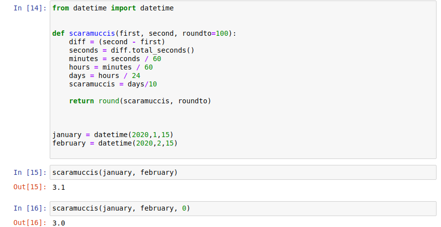

# themooch

## A "Scaramucci" is a unit of time measued by 10 days. Named for the shortest serving White House communications director in U.S. History.  

The function takes in two datetime objects and optionally an integer to round to. 

_Citations_

Concha, J. (2017). Some White House aides are calling a short period of time a 'Mooch'. Retrieved 25 October 2020, from https://thehill.com/blogs/blog-briefing-room/news/366508-some-white-house-aides-are-calling-a-short-period-of-time-a